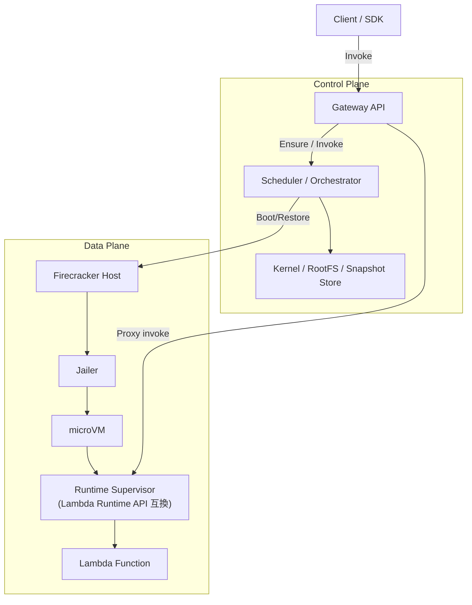
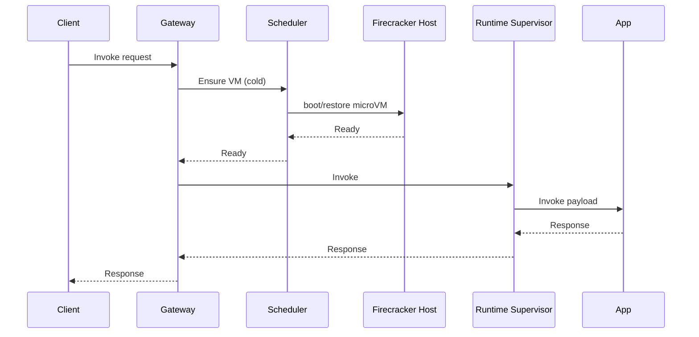
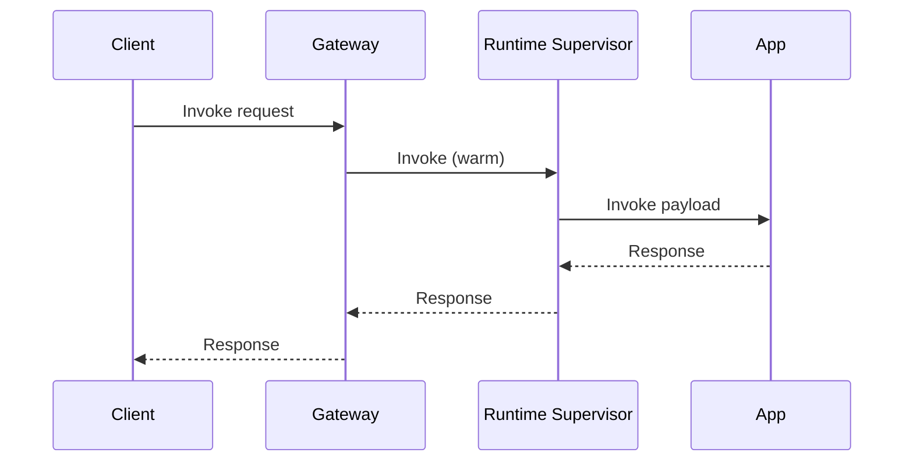
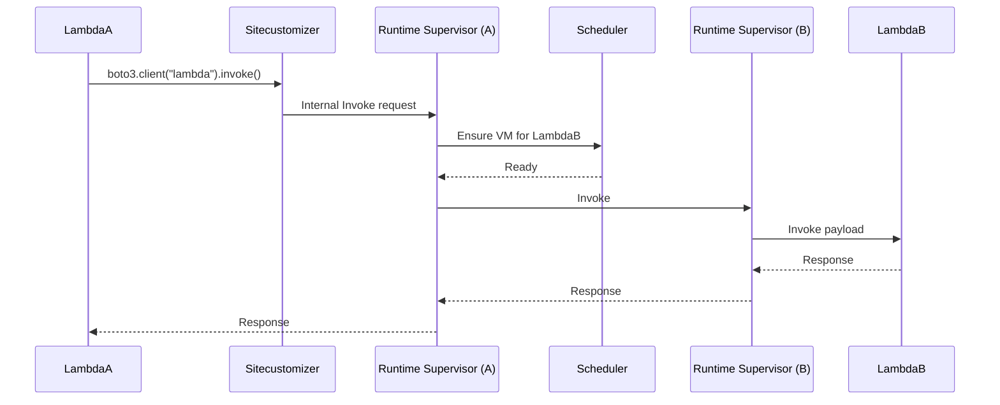

# Firecracker 導入による高速起動ロードマップ（RIE 廃止案）

## 目的
- Firecracker を用いて Lambda の起動時間を短縮し、RIE ベースの起動方式を廃止する。
- 既存の **boto3 hook / sitecustomizer.py** の互換性を維持し、Lambda-to-Lambda の `boto3.client("lambda").invoke()` を引き続きサポートする。

## 現行（RIE）構成の要点
- Gateway から Lambda の RIE エンドポイントにリクエストを転送。
- `tools/generator/runtime/site-packages/sitecustomize.py` が `boto3.client` をパッチしており、
  - Trace 伝播や log 付与
  - `boto3.client("lambda").invoke()` のフック
  を行っている。

## Firecracker 導入後の前提
- Firecracker は **microVM を起動・隔離するエンジン**であり、
  **Lambda Runtime API / Invoke API 互換層は別途必要**。
- RIE 廃止後は、Runtime API 互換機能（init/invoke/shutdown）と
  `boto3.client("lambda").invoke()` 経路の維持が必須。

---

## アーキテクチャ（提案）

### 主要責務
- **Gateway**: 既存の Invoke エンドポイント互換を維持し、内部で Scheduler を呼び出す。
- **Scheduler / Orchestrator**: microVM 割当、snapshot 管理、warm pool 管理。
- **Runtime Supervisor**: Lambda Runtime API 互換 (init/invoke/shutdown)、ログ/メトリクス、
  `boto3.client("lambda").invoke()` 用の **Internal Invoke API** を提供。

---

## boto3 hook / sitecustomizer の扱い

### 1) sitecustomizer の役割は継続
- `tools/generator/runtime/site-packages/sitecustomize.py` は **RIE 依存の処理ではなく、boto3 の hook**を提供している。
- Firecracker 導入後も **Lambda コンテナ/VM 内に同じ sitecustomizer を配置**し、以下を維持する:
  - Trace context の注入
  - logs/dynamodb/s3 のエンドポイント書き換え
  - `boto3.client("lambda").invoke()` の挙動変更

### 2) Internal Invoke の宛先を Runtime Supervisor に切り替え
- 現状は Gateway へ向けて invoke しているが、Firecracker 化後は **Runtime Supervisor の Invoke API** へ接続。
- `sitecustomizer` の内部実装で、
  - 送信先 URL を **Runtime Supervisor の内部エンドポイント**に変更。
  - リクエスト形式は現状の Gateway 互換を踏襲。

### 3) boto3 Lambda invoke の互換性
- `boto3.client("lambda").invoke()` が以下を満たす:
  - **同期 / 非同期**両方に対応
  - 既存の `ClientContext`/Trace 伝播が維持
  - 返却形式 (`Payload`, `StatusCode`) が変わらない

---

## シーケンス（Cold / Warm）

### Cold Start

### Warm Start

---

## Lambda-to-Lambda (boto3) シーケンス

---

## ロードマップ

### Phase 0: POC
- Firecracker 起動時間計測 (snapshot/restore 含む)
- Runtime Supervisor の最小 API モック
- sitecustomizer の Invoke 経路を Runtime Supervisor 向けに切替える POC

### Phase 1: 最小実行基盤
- Scheduler + Firecracker Host の連携
- Runtime API 互換（init/invoke/shutdown）
- `boto3.client("lambda").invoke()` の sync/async 対応

### Phase 2: 最適化
- snapshot restore / pre-warm pool
- Concurrency 制御
- Observability (log/metric/trace)

### Phase 3: 本番対応
- multi-tenant isolation
- 監視・アラート
- コスト最適化 (pool size, snapshot rotation)

---

## リスクと未決事項
- snapshot の互換性（kernel/rootfs 更新時の invalidation）
- Runtime API 互換レベル（extensions の扱い）
- sitecustomizer 依存コードの保守
- 既存 Gateway 互換 API との整合性
