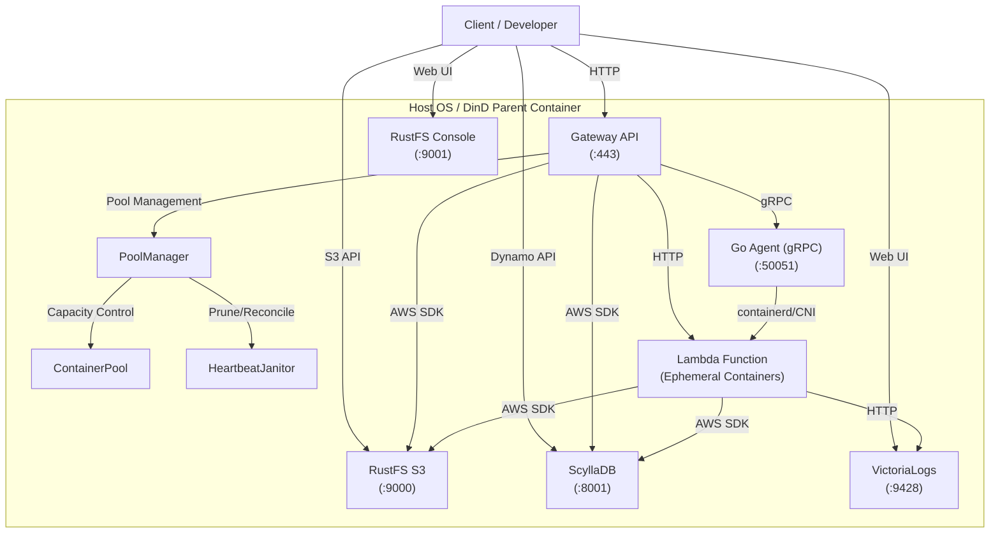

# システム仕様書

## 1. 概要
本システムは、コンテナ技術(Docker / containerd)を用いてエッジサーバーレス環境をシミュレートするための基盤です。開発時はホストOS上の `docker-compose.yml`、検証/本番では DinD (Docker-in-Docker) 構成の `docker-compose.dind.yml` を利用し、Gateway、ストレージ、データベース、Lambda実行環境を集約します。

## 2. コンポーネント構成

システムは以下の主要コンポーネントで構成されます。



### 2.1 Gateway API (FastAPI)
- **役割**: クライアントからのリクエスト受付、認証、およびLambda関数へのリクエストルーティング。
- **通信**: クライアントとはHTTPで通信。内部では Go Agent (gRPC) と連携し、Lambdaコンテナの起動確認とリクエスト転送を行います。
- **ポート**: `443`

#### ディレクトリ構成
```
services/gateway/
├── main.py              # エンドポイント定義（認証、ヘルスチェック、プロキシ）
├── config.py            # 環境変数ベースの設定管理
├── api/                 # DI/依存関係
├── core/                # 共通ロジック（認証、イベント構築、サーキットブレーカー等）
├── models/              # データモデル
└── services/            # ビジネスロジック
    ├── container_pool.py  # Conditionベースの同時実行制御とプーリング
    ├── pool_manager.py    # プール全体の管理
    ├── janitor.py         # アイドル/孤児コンテナ整理
    ├── lambda_invoker.py  # Lambda(RIE)へのHTTPリクエスト送信
    ├── grpc_provision.py  # Go Agent への gRPC プロビジョニング
    ├── function_registry.py # functions.yml 読み込み
    └── route_matcher.py   # routing.ymlベースのパスマッチング
```

#### 主要コンポーネント
| モジュール                         | 責務                                                                 |
| ---------------------------------- | -------------------------------------------------------------------- |
| `core/event_builder.py`            | API Gateway Lambda Proxy Integration互換イベント構築                 |
| `services/gateway/services/pool_manager.py` | コンテナのキャパシティ確保、プロビジョニング要求、返却管理 |
| `services/container_pool.py`       | 関数ごとの Condition 待ち行列管理とコンテナインスタンスの保持       |
| `services/janitor.py`              | アイドル/孤児コンテナの整理                                          |
| `services/lambda_invoker.py`       | `httpx` を使用した Lambda RIE へのリクエスト送信                     |
| `services/grpc_provision.py`       | Go Agent への gRPC 呼び出し                                           |

### 2.2 Go Agent (Internal)
- **役割**: Lambdaコンテナのライフサイクル管理（オンデマンド起動、削除、状態取得）。
- **通信**: Gateway からの gRPC リクエストにより containerd を操作。
- **主な RPC**:
    - `EnsureContainer`: コンテナ起動・Ready確認
    - `DestroyContainer`: コンテナ削除
    - `ListContainers`: 稼働中コンテナの状態取得（Janitor が利用）
    - `PauseContainer` / `ResumeContainer`: 将来的なウォームスタート向けの操作（未使用）

### 2.3 RustFS (Storage)
- **役割**: AWS S3互換のオブジェクトストレージ。Lambdaコードやデータの保存に使用。
- **構成**:
    - **API**: ポート `9000` (S3互換)
    - **Console**: ポート `9001` (管理Web UI)
- **認証**: 環境変数でAccessKey/SecretKeyを設定。

### 2.4 ScyllaDB (Database)
- **役割**: Dockerコンテナ向けの高性能NoSQLデータベース。AWS DynamoDB互換API (Alternator) を提供。
- **ポート**: `8001` (Alternator API)

### 2.5 VictoriaLogs
- **役割**: ログ収集・管理基盤。LambdaやGatewayのログを集約可。
- **ポート**: `9428` (Web UI/API)

## 3. ネットワーク仕様

Gateway と Go Agent は `network_mode: host` で起動し、その他のサービスはポートをホストに公開します。

| サービス名     | コンテナ内ポート | ホスト公開ポート | URL                     | プロトコル          |
| -------------- | ---------------- | ---------------- | ----------------------- | ------------------- |
| Gateway API    | 443              | 443              | `https://localhost:443` | HTTPS               |
| Agent gRPC     | 50051            | 50051            | `grpc://localhost:50051` | gRPC               |
| RustFS API     | 9000             | 9000             | `http://localhost:9000` | HTTP                |
| RustFS Console | 9001             | 9001             | `http://localhost:9001` | HTTP                |
| ScyllaDB       | 8000             | 8001             | `http://localhost:8001` | HTTP (DynamoDB API) |
| VictoriaLogs   | 9428             | 9428             | `http://localhost:9428` | HTTP                |

## 4. データ永続化

開発環境 (`docker-compose.yml`) では **named volume** を使用し、DinD 環境ではホストディレクトリをマウントします。

- **開発環境 (named volume)**:
    - `rustfs_data` -> RustFSデータ
    - `scylladb_data` -> ScyllaDBデータ
    - `victorialogs_data` -> ログデータ
    - `registry_data` -> レジストリデータ
- **DinD環境 (bind mount)**:
    - `./data` -> `/app/data` (親コンテナ) -> 子コンテナへ引き継ぎ
    - `./logs` -> `/logs`

## 5. デプロイメントモデル

### 5.1 開発環境 (Docker Compose)
`docker-compose.yml` を使用して、ホストOS上で直接サービス群を起動します。
- ボリューム: named volume を使用

### 5.2 本番/検証環境 (DinD)
`docker-compose.dind.yml` を使用して、親コンテナ(`esb-root`)を起動します。
- 親コンテナが内部でさらに `docker-compose.yml` を使用して子コンテナ群を起動します。
- ホストの `./data` は親コンテナの `/app/data` にマウントされ、子コンテナに引き継がれます。
