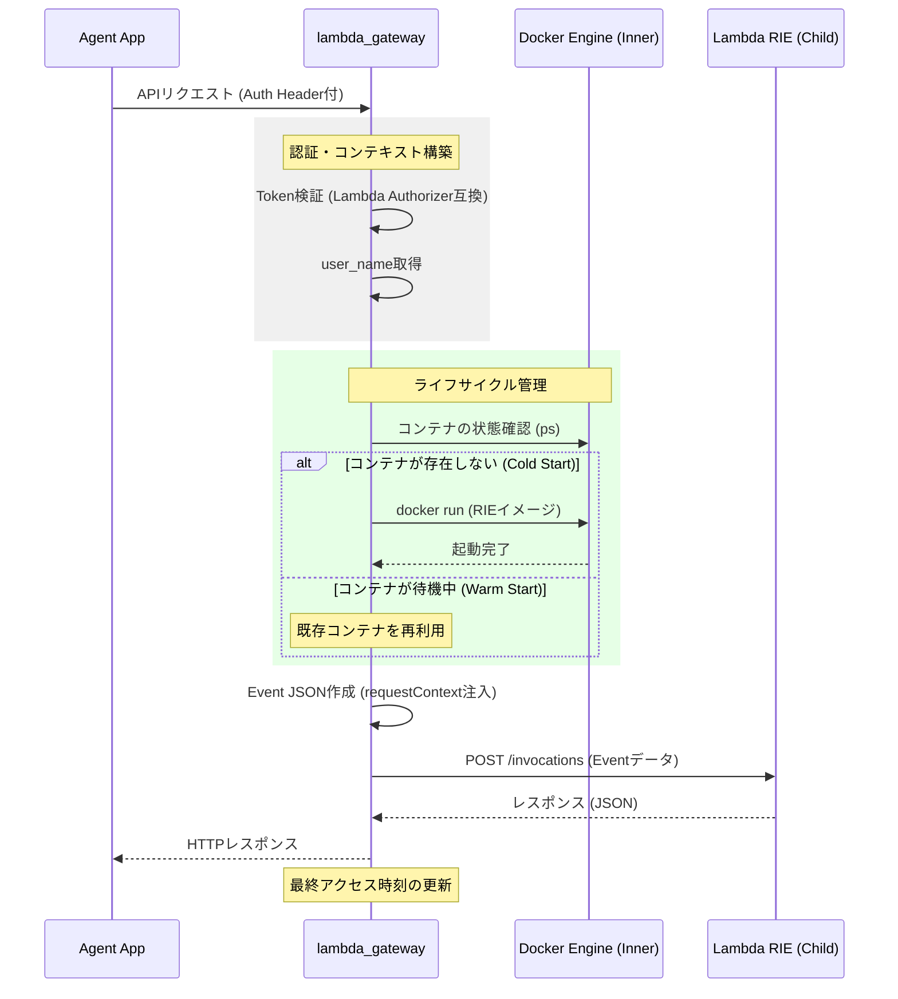
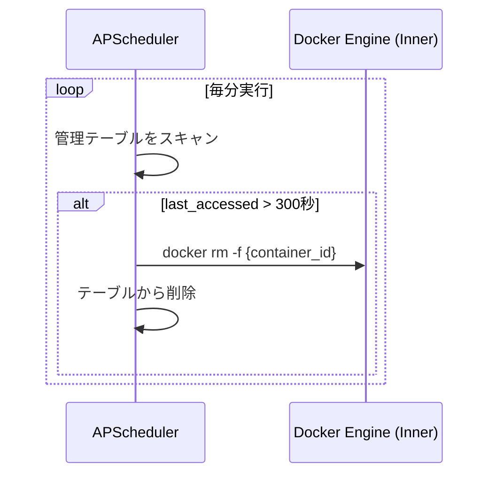

これまでの対話に基づき、完全内包型DinD環境における「API Gateway / Lambda互換エッジサーバー」の仕様書をまとめました。

---

# システム仕様書：エッジサーバー・サーバーレス・シミュレーター (DinD構成)

## 1. 概要

本システムは、AWS API Gateway および Lambda (Authorizer含む) の挙動をオンプレミスのエッジ環境で再現するためのプロトタイプです。Docker in Docker (DinD) 技術を用い、全てのコンポーネントを一つのコンテナイメージに内包し、ネットワーク隔離環境での動作を可能にします。

## 2. アーキテクチャ構成

### 2.1 インフラ階層

* **Host:** Hyper-V 上の Linux VM (Ubuntu)
* **Parent Container:** DinD (Docker Engineを内蔵)
* **Child Containers:**
  * `lambda_gateway`: 管理・プロキシ・認証
  * `APScheduler`: ライフサイクル管理・定期実行
  * `onpre-storage` (RustFS): S3互換ストレージ
  * `onpre-database` (ScyllaDB): DynamoDB互換データベース
  * `Lambda RIE`: 各種ビジネスロジック (AWS互換)

### 2.2 コンテナ管理方式

* **完全内包型:** ビルド時に子イメージを `docker load` し、外部通信なしで展開可能とする。
* **ライフサイクル:** プーリング / アイドルタイムアウト方式。

### 2.3 データ層構成

データ層は `docker-compose.internal.yml` にて Gateway コンテナ内部から起動します。

| サービス     | OSS                 | コンテナ名       | ポート                      | 永続化パス         |
| ------------ | ------------------- | ---------------- | --------------------------- | ------------------ |
| S3互換       | RustFS              | `onpre-storage`  | 9000 (API) / 9001 (Console) | `/data/s3_storage` |
| DynamoDB互換 | ScyllaDB Alternator | `onpre-database` | 8000                        | `/data/scylladb`   |

---

## 3. 処理フロー

### 3.1 リクエスト実行シーケンス

Agent App からのリクエストを、認証・動的起動を経て Lambda へ中継するフローです。



### 3.2 アイドルタイムアウト・クリーンアップ

リソースを解放するためのバックグラウンド処理フローです。



---

## 4. 機能詳細仕様

### 4.1 lambda_gateway (API Gateway互換)

* **認証機能:** * `/login` エンドポイントを提供。固定ユーザーまたは簡易DB照合でTokenを発行。
* 全てのリクエストから `Authorization` ヘッダーを抽出し検証。


* **Context注入:**
* 既存の Lambda コードが期待する `requestContext.authorizer.cognito:username` 構造を模倣した JSON を生成。


* **プロキシ:**
* HTTPリクエストを Lambda 起動イベント（JSON形式）へカプセル化。


### 4.2 ライフサイクル管理 (Pooling)

* **起動条件:** 指定された関数名のコンテナが未起動の場合のみ `docker run` を実行。
* **同時実行制御:** 同時に維持するコンテナ数の上限（スロット）を設定。上限超過時は `503 Service Unavailable`。
* **ヘルスチェック:** 起動直後のコンテナが HTTP 受付可能になるまでポーリング（リトライ）を実施。

### 4.3 APScheduler

* **定期実行:** 指定された cron スケジュールに基づき、`lambda_gateway` の内部関数を直接呼び出し、Lambda を実行。
* **GC処理:** アイドル状態のコンテナを強制停止・削除し、メモリリソースを確保。

### 4.4 S3互換ストレージ (RustFS)

オブジェクトストレージとして RustFS を採用し、S3互換APIを提供します。

#### コンテナ定義

```yaml
s3-storage:
  image: rustfs/rustfs:latest
  container_name: onpre-storage
  volumes:
    - /data/s3_storage:/data  # Gatewayコンテナ経由でホストOSへ永続化
  environment:
    - RUSTFS_ROOT_USER=rustfsadmin
    - RUSTFS_ROOT_PASSWORD=rustfsadmin
    - RUSTFS_COMPRESSION=auto
    - RUSTFS_DEDUPLICATION=true
  command: server /data
  ports:
    - "9000:9000"  # S3互換API
    - "9001:9001"  # 管理コンソール
  healthcheck:
    test: ["CMD-SHELL", "curl -f http://localhost:9000 || exit 1"]
    interval: 30s
    timeout: 20s
    retries: 5
```

#### 接続仕様

| 項目               | 値                          |
| ------------------ | --------------------------- |
| **エンドポイント** | `http://onpre-storage:9000` |
| **管理コンソール** | `http://onpre-storage:9001` |
| **通信方式**       | HTTP / S3互換API            |
| **認証方式**       | なし（オンプレ閉域環境）    |

#### Lambda関数からの接続例

```python
import boto3

s3 = boto3.client(
    "s3",
    endpoint_url="http://onpre-storage:9000",
    aws_access_key_id="rustfsadmin",
    aws_secret_access_key="rustfsadmin"
)
```

### 4.5 DynamoDB互換データベース (ScyllaDB Alternator)

NoSQLデータベースとして ScyllaDB を採用し、Alternator モードで DynamoDB互換APIを提供します。

#### コンテナ定義

```yaml
database:
  image: scylladb/scylla:latest
  container_name: onpre-database
  volumes:
    - /data/scylladb:/var/lib/scylla
  command: --smp 1 --memory 1G --developer-mode 1 --alternator-port 8000 --alternator-write-isolation global
  healthcheck:
    test: ["CMD-SHELL", "nodetool status"]
    interval: 30s
    timeout: 20s
    retries: 5
```

#### 接続仕様

| 項目               | 値                                    |
| ------------------ | ------------------------------------- |
| **エンドポイント** | `http://onpre-database:8000`          |
| **通信方式**       | HTTP / Alternator API（DynamoDB互換） |
| **認証方式**       | なし（オンプレ閉域環境）              |
| **リソース制限**   | 1 CPU / 1GB メモリ                    |

#### Lambda関数からの接続例

```python
import boto3

dynamodb = boto3.client(
    "dynamodb",
    endpoint_url="http://onpre-database:8000",
    region_name="us-east-1"  # ダミー値（必須）
)
```

## 7. 検証（テスト）方針

### 7.1 対象スコープ
- **FastAPI Gateway**
  - ルーティングロジック (Unit Test)
  - 認証ミドルウェア (Unit Test)
- **Lambda Function**
  - ハンドラロジック (Unit Test)
  - S3/DynamoDBアクセス (Integration Test)
- **E2E統合テスト**
  - `HTTP Request` → `Gateway` → `Lambda RIE` → `RustFS/ScyllaDB` の完全なフロー

### 7.2 テスト構成
1. **Unit Tests**: 個別モジュール（`test_unit_*.py`）
2. **E2E Tests (`test_e2e.py`)**:
    - GatewayをDocker In Docker (DinD) 環境でコンテナとして起動
    - `docker-compose.yml` を使用
    - 外部からHTTPリクエストを送信して統合動作を検証
    - 認証、ルーティング、Lambda実行、データ永続化を一気通貫でテスト

### 7.3 テスト実行方法
```bash
# Gateway起動 (必須)
docker compose up -d gateway

# テスト実行
pytest tests/test_e2e.py -v
```

## 8. 既知の制限事項
- **コールドスタート**: 現在はGateway起動時にLambdaコンテナも事前起動する方式。
- **動的IP解決**: Gatewayは動的にDockerコンテナのIPを解決するが、IP変動時の追従はリクエスト毎の解決で対応。
- **ユーザー情報互換**: Gatewayは `requestContext.authorizer` 直下にも `cognito:username` を含め、既存Lambdaコードとの互換性を確保。

## 9. 今後の拡張計画
- Lambdaコンテナの動的起動（コールドスタート/ウォームアップ）
- CloudWatch互換のログ収集基盤
- X-Ray互換のトレーシング
