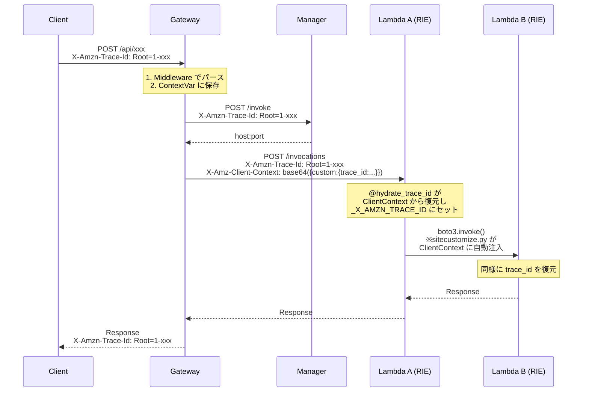

# X-Amzn-Trace-Id によるトレーシング

本ドキュメントでは、Edge Serverless Box (ESB) における分散トレーシングの実装について、コードレベルで解説します。

## 概要

AWS Lambda 本番環境では `X-Amzn-Trace-Id` ヘッダーが自動的に `_X_AMZN_TRACE_ID` 環境変数に変換されますが、Lambda RIE (Runtime Interface Emulator) ではこの機能がありません。ESB では **ClientContext 経由のブリッジ機構**を実装してこの制限を回避しています。

## Trace ID フォーマット

AWS X-Ray 準拠のフォーマット:

```
Root=1-{timestamp:08x}-{unique_id:24hex};Sampled=1

例: Root=1-67687c5a-a1b2c3d4e5f67890abcdef01;Sampled=1
```

| フィールド | 説明 |
|-----------|------|
| `Root` | トレースのルート識別子 (`1-XXXXXXXX-XXXXXXXXXXXXXXXXXXXXXXXX`) |
| `Parent` | 親スパンID（オプション） |
| `Sampled` | サンプリングフラグ (`0` or `1`) |

**実装**: `services/common/core/trace.py`

## トレース伝播フロー



## コンポーネント詳細

### 1. Gateway Middleware

**ファイル**: `services/gateway/main.py`

```python
@app.middleware("http")
async def request_id_middleware(request: Request, call_next):
    # ヘッダーから Trace ID を取得または新規生成
    trace_id_str = request.headers.get("X-Amzn-Trace-Id")
    
    if trace_id_str:
        set_trace_id(trace_id_str)  # パースして ContextVar に保存
    else:
        trace = TraceId.generate()
        trace_id_str = str(trace)
        set_trace_id(trace_id_str)
    
    response = await call_next(request)
    
    # レスポンスヘッダーに付与
    response.headers["X-Amzn-Trace-Id"] = trace_id_str
    
    clear_trace_id()  # リクエスト終了時にクリア
    return response
```

**役割**:
- 受信した `X-Amzn-Trace-Id` ヘッダーをパース
- 存在しない場合は新規生成
- `ContextVar` に保存して後続処理で利用可能に
- レスポンスヘッダーにも付与

---

### 2. Request Context (ContextVar)

**ファイル**: `services/common/core/request_context.py`

```python
from contextvars import ContextVar

_trace_id_var: ContextVar[Optional[str]] = ContextVar("trace_id", default=None)

def get_trace_id() -> Optional[str]:
    """現在のリクエストの Trace ID を取得"""
    return _trace_id_var.get()

def set_trace_id(trace_id_str: str) -> str:
    """Trace ID をパースしてセット"""
    trace = TraceId.parse(trace_id_str)
    _trace_id_var.set(str(trace))
    return str(trace)
```

**役割**:
- `asyncio` 対応のスレッドローカル変数
- どこからでも `get_trace_id()` で現在の Trace ID を取得可能

---

### 3. Lambda Invoker (ClientContext 注入)

**ファイル**: `services/gateway/services/lambda_invoker.py`

```python
async def do_post():
    headers = {"Content-Type": "application/json"}
    
    if trace_id:
        # HTTP ヘッダーとして伝播
        headers["X-Amzn-Trace-Id"] = trace_id
        
        # RIE 対策: ClientContext に埋め込む
        client_context = {"custom": {"trace_id": trace_id}}
        json_ctx = json.dumps(client_context)
        b64_ctx = base64.b64encode(json_ctx.encode("utf-8")).decode("utf-8")
        headers["X-Amz-Client-Context"] = b64_ctx
```

**役割**:
- Lambda RIE へのリクエスト時に `X-Amzn-Trace-Id` ヘッダーを付与
- **RIE はこのヘッダーを無視するため**、`X-Amz-Client-Context` にも埋め込む
- ClientContext は Base64 エンコードされた JSON

---

### 4. trace_bridge.py (Lambda 側デコレータ)

**ファイル**: `tests/fixtures/layers/common/python/trace_bridge.py`

```python
def hydrate_trace_id(handler):
    @wraps(handler)
    def wrapper(event, context):
        trace_id = None
        
        # ClientContext.custom.trace_id から取得
        if hasattr(context, "client_context") and context.client_context:
            custom = getattr(context.client_context, "custom", None)
            if custom and isinstance(custom, dict) and "trace_id" in custom:
                trace_id = custom["trace_id"]
        
        # 環境変数にセット
        if trace_id and not os.environ.get("_X_AMZN_TRACE_ID"):
            os.environ["_X_AMZN_TRACE_ID"] = trace_id
        
        return handler(event, context)
    
    return wrapper
```

**使用例**:
```python
from trace_bridge import hydrate_trace_id

@hydrate_trace_id
def lambda_handler(event, context):
    # ここで os.environ["_X_AMZN_TRACE_ID"] にアクセス可能
    trace_id = os.environ.get("_X_AMZN_TRACE_ID")
```

**役割**:
- RIE の `context.client_context.custom` から `trace_id` を抽出
- `_X_AMZN_TRACE_ID` 環境変数にセット
- AWS Lambda 本番環境と同じ方法で Trace ID にアクセス可能に

---

### 5. sitecustomize.py (Lambda → Lambda 間の自動注入)

**ファイル**: `tools/generator/runtime/site-packages/sitecustomize.py`

```python
def _inject_client_context_hook(params, **kwargs):
    """
    boto3 Lambda.invoke() 呼び出し時に自動的に
    ClientContext に trace_id を注入するフック
    """
    trace_id = _get_current_trace_id()  # 環境変数から取得
    if not trace_id:
        return
    
    ctx_data = {}
    if "ClientContext" in params:
        ctx_data = json.loads(base64.b64decode(params["ClientContext"]))
    
    if "custom" not in ctx_data:
        ctx_data["custom"] = {}
    
    if "trace_id" not in ctx_data["custom"]:
        ctx_data["custom"]["trace_id"] = trace_id
        params["ClientContext"] = base64.b64encode(
            json.dumps(ctx_data).encode()
        ).decode()

# boto3 イベントに登録
client.meta.events.register(
    "provide-client-params.lambda.Invoke",
    _inject_client_context_hook
)
```

**役割**:
- Lambda 関数内から `boto3.client("lambda").invoke()` を呼び出した時
- 自動的に現在の Trace ID を ClientContext に注入
- 開発者は何もせずに Trace ID が連鎖伝播される

---

## ログへの Trace ID 付与

**ファイル**: `services/common/core/logging_config.py`

```python
class CustomJsonFormatter(logging.Formatter):
    def format(self, record):
        log_record = {
            "_time": self._format_time(record),
            "level": record.levelname,
            "message": record.getMessage(),
            "trace_id": get_trace_id(),  # ContextVar から取得
            # ...
        }
        return json.dumps(log_record)
```

すべてのログに自動的に `trace_id` フィールドが追加されます。

---

## トラブルシューティング

### Trace ID が `not-found` になる

**原因**: `@hydrate_trace_id` デコレータが付いていない

**解決策**:
```python
from trace_bridge import hydrate_trace_id

@hydrate_trace_id  # 必ず付ける
def lambda_handler(event, context):
    ...
```

### Lambda 連鎖呼び出しで Trace ID が途切れる

**原因**: sitecustomize.py が正しくロードされていない

**確認方法**:
```bash
docker logs lambda-xxx | grep sitecustomize
# "[sitecustomize] All patches applied" が出力されていれば OK
```

### VictoriaLogs で Trace ID が表示されない

**原因**: ログフォーマッタが `trace_id` フィールドを出力していない

**確認**: fluent-bit 経由でログが正しくパースされているか確認
